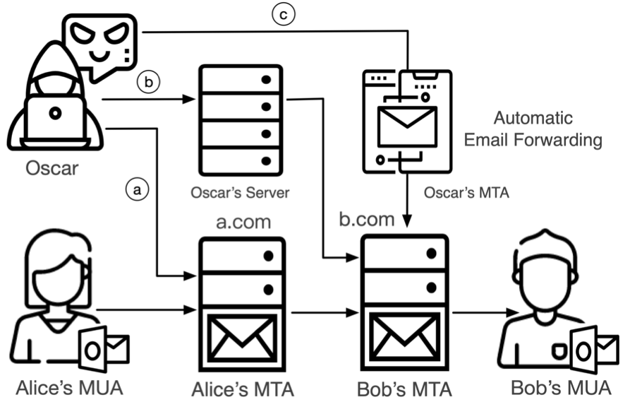
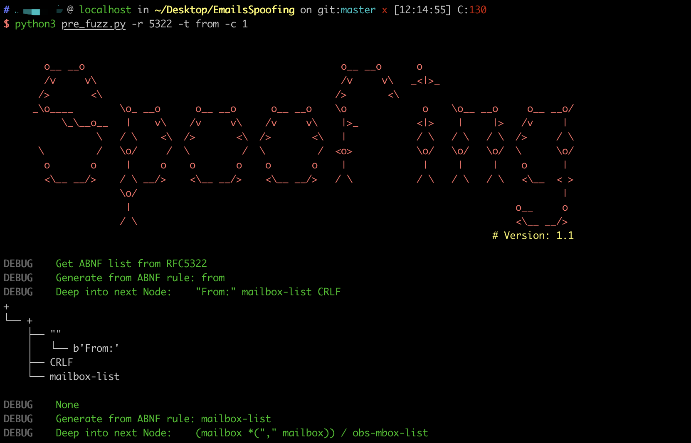

# EmailTestTools

> This repo is some tools for email test.

We systematically analyzes the email delivery process based on the four key steps of the authentication process: a. sending authentication, b. receiving verification, c. forwarding verification, d. UI rendering. 

As shown in the figure below, we defined three ways of email sender spoofing attacks: a. Shared MTA Attack, b. Direct MTA Attack. c. Forward MTA Attack. Futhermore, we found 14 email spoofing attacks capable of bypassing SPF, DKIM, DMARC and user-interface protections. By combining different attacks, a spoofing email can completely pass all prevalent email security protocols, and no security warning will be shown on the receiver’s UI. As a result, it is very difficult to identify whether such an email is forged, even for people with a technical background.

<div align=center></div>

Our study reveals the vulnerability of this chain-based authentication structure in email ecosystem. The attacks we found share the high-level theme that the inconsistency between multiple parties’ understanding and implementation of security mechanisms has led to more security issues. One issue may seem harmless to a single part of the authentication, but when the part is integrated into a larger system, the previously harmless attack may cause serious security problems, especially when jointly employed with other attack methods.

At last, to better protect vulnerable users, we made our testing tool publicly to help email administrators to evaluate and strengthen their mail systems’ security.

## Screenshots



## Installation

- Download this tool

```
git clone https://github.com/EmailTestTools/EmailTestTools.git
```

- Install dependencies

```
sudo pip install -r requirements.txt
```

## Getting started

We prepared three tools for the email test.

1. [pre_fuzz.py](./pre_fuzz.py) will automatically grab the ABNF rules in the relevant email specifications and generate test samples according to the ABNF rules. Because common mail services usually refuse to handle emails with highly deformed headers, we have specified set certain values for our empirical experiment purposes. Besides, we also  introduced the common mutation methods in the protocol fuzz , such as header repeating, inserting spaces, inserting Unicode characters, header encoding, and case variation.

   Usage:

   | Short Form | Long Form | Description                                                  |
   | ---------- | --------- | ------------------------------------------------------------ |
   | -r         | --rfc     | The RFC number of the ABNF rule to be extracted.             |
   | -t         | --target  | The field to be fuzzed in ABNF rules.                        |
   | -c         | --count   | The amount of ambiguity data that needs to be generated according to ABNF rules. |

   > python3 pre_fuzz.py -r 5322 -t from -c 255

2. [run_test.py](./run_test.py) will automatically test the target  according to the test data. We have also carefully controlled the message sending rate with intervals over 10 minutes to minimize the impact on the target email services.

   Usage:

   | Short Form | Long Form | Description                                     |
   | ---------- | --------- | ----------------------------------------------- |
   | -m         | --mode    | The attack mode with spoofing emails(SMTP/MTA). |
   | -t         | --target  | The target field to test.                       |

   >  python3 run_test.py -m MTA -t MIME

3. We analyze and summarize the employed adversarial techniques into two scripts that make email sender spoofing successful in practice. These two scripts are used to verify vulnerabilities in real life.

   [smtp_send.py](./smtp_send.py) simulate as user (MUA) to Sender's MTA via SMTP protocol. And then, it will send the mail to the receiver. The role of this tool is to test the security issues of the Sender's MTA and test whether the receiver can accept abnormal email.

   [mta_send.py](./mta_send.py) simulate as Sender's MTA to communicate with Receiver's MTA. This tool can be simulated as any email sender and can test receiver's security.

   Usage:
   smtp_send.py
    ```python
    if __name__ == '__main__':
        """
        Send normal smtp email to receiveUser
        :param user:
        :param passwd:
        :param smtp_server:
        :param receiveUser:
        :param subject:
        :param content: both html and normal text is supported
        :param filename: put Mail attachment into uploads folder and specify 'filename'
        :param image: if you want to add image into email body, you can put "" in 'content' and specify 'image' like 'filename'
        Other parameters like mail_from,mime_from,mime_from1,mime_from2 can be specified if smtp server allow.
        :return:
        """
        test_normal(user, passwd, smtp_server, receiveUser,subject,content,mime_from=None,filename=filename,mime_from1=None,mime_from2=None,mail_from=None,image=image)
    ```
    mta_send.py
    ```python
    if __name__ == "__main__":
        mail_from = 'xxx@test.com'
        mime_from = 'xxx@test.com'
        reply_to = mime_from
        to_email = 'xxx@gmail.com'
        subject = 'Tsis is subject'
        content = """This is content"""
        """
        Send normal smtp email to receiverUser
        :param mail_from:
        :param mime_from:
        :param to_email:MTA target which can be changed to what you like.
        :param subject:
        :param content: both html and normal text is supported
        :param filename: put Mail attachment into uploads folder and specify 'filename'
        Other parameters like helo,mime_from1,mime_from2,sender can be specified.
        :return:
        """
        test_normal(mail_from, to_email, subject, content, mime_from=mime_from, mime_from1=None,mime_from2=None, sender=None,helo=None,filename=None)
    ```

More functions await your exploration. Have fun~

## Version

**Current version is 1.1**