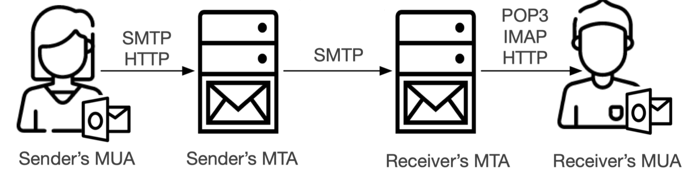

# EmailTestTools

> This repo is some tools for email test.

Simple Mail Transfer Protocol (SMTP) is a basic protocol for email services. The following figure shows the basic email delivery process. An email written by a sender is transmitted from the Mail User Agent (MUA) to the Mail Transport Agent (MTA) via SMTP or HTTP protocol. Then, the sender’s MTA communicates with and transmits the mail to a receiver’s MTA via the SMTP protocol, which later delivers the message content to the receiver’s MUA via HTTP, IMAP, or POP3 protocols.



## Getting started

We prepared two tools for the email test: SMTP send and MTA send. 

[smtp_send.py](./smtp_send.py) simulate as user (MUA) to Sender's MTA via SMTP protocol. And then, it will send the mail to the receiver. The role of this tool is to test the security issues of the Sender's MTA and test whether the receiver can accept abnormal email.

[mta_send.py](./mta_send.py) simulate as Sender's MTA to communicate with Receiver's MTA. This tool can be simulated as any email sender and can test receiver's security.

### Usage


smtp_send.py
```python
if __name__ == '__main__':
    """
    Send normal smtp email to receiveUser
    :param user:
    :param passwd:
    :param smtp_server:
    :param receiveUser:
    :param subject:
    :param content: both html and normal text is supported
    :param filename: put Mail attachment into uploads folder and specify 'filename'
    :param image: if you want to add image into email body, you can put "" in 'content' and specify 'image' like 'filename'
    Other parameters like mail_from,mime_from,mime_from1,mime_from2 can be specified if smtp server allow.
    :return:
    """
    account = ACCOUNTS['account']
    #Change 'account' to what you like to test.
    user = account['user']
    passwd = account['apipass']
    smtp_server = account['smtp_server']
    receiveUser = 'xxx@gmail.com'
    #Change receiveUser to what you like to test.
    subject = 'This is subject'
    content = """This is content"""
    filename = None
    image = None
    test_normal(user, passwd, smtp_server, receiveUser,subject,content,mime_from=None,filename=filename,mime_from1=None,mime_from2=None,mail_from=None,image=image)
```

Besides, you can send abnormal email via Sender's MTA such as:

`test_mail_mime_attack(user, passwd, smtp_server, receiveUser)
special_unicode = '\xff'
test_mail_mime_xff_attack(user, passwd, smtp_server, receiveUser,special_unicode)
test_multiple_mime_from1(user, passwd, smtp_server, receiveUser)
test_multiple_mime_from2(user, passwd, smtp_server, receiveUser)
test_multiple_value_mime_from1(user, passwd, smtp_server, receiveUser)
test_multiple_value_mime_from2(user, passwd, smtp_server, receiveUser)
test_multiple_value_mime_to(user, passwd, smtp_server, receiveUser)
test_mime_to(user, passwd, smtp_server, receiveUser)
test_IDN_mime_from_domain(user, passwd, smtp_server, receiveUser)
test_IDN_mime_from_username(user, passwd, smtp_server, receiveUser)
test_reverse_mime_from_user(user, passwd, smtp_server, receiveUser)
test_reverse_mime_from_domain(user, passwd, smtp_server, receiveUser)`


mta_send.py

```python
if __name__ == "__main__":
    mail_from = 'xxx@test.com'
    mime_from = 'xxx@test.com'
    reply_to = mime_from
    to_email = 'xxx@gmail.com'
    subject = 'Tsis is subject'
    content = """This is content"""
    """
    Send normal smtp email to receiverUser
    :param mail_from:
    :param mime_from:
    :param to_email:MTA target which can be changed to what you like.
    :param subject:
    :param content: both html and normal text is supported
    :param filename: put Mail attachment into uploads folder and specify 'filename'
    Other parameters like helo,mime_from1,mime_from2,sender can be specified.
    :return:
    """
    test_normal(mail_from, to_email, subject, content, mime_from=mime_from, mime_from1=None,mime_from2=None, sender=None,helo=None,filename=None)
```

Besides, you can send abnormal email via mta_send.py such as:

`test_reverse_mime_from(to_email)
test_mime_from_empty(mail_from,to_email)
test_IDN_mime_from(to_email)
sender = 'admin@gmail.com'
test_sender(mail_from,to_email,sender)
test_mail_mime_attack(mail_from,to_email)
test_mail_mime_attack_diff_domain(mail_from,to_email)
test_mime_from_badchar(to_email)
helo = 'test.com'
test_mail_from_empty(mime_from,to_email,helo)
test_multiple_value_mime_from1(mail_from,to_email)
test_multiple_value_mime_from2(mail_from,to_email)
test_multiple_mime_from1(mail_from,to_email)
test_multiple_mime_from2(mail_from,to_email)`


More functions await your exploration. Have fun~


